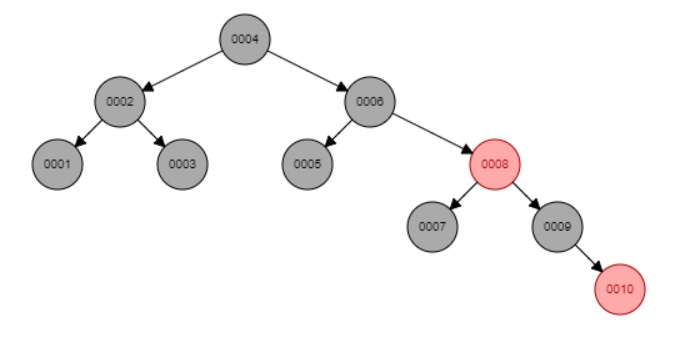
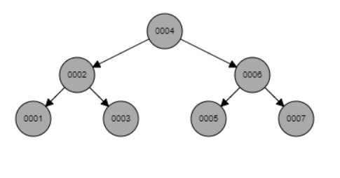

```
Пустое учение-это дерево. [Иеремия 10:8]
```

# Постройте, добавьте, удалите ...

- [Splay](http://www.cs.armstrong.edu/liang/animation/web/SplayTree.html)
- [AVL](http://www.cs.armstrong.edu/liang/animation/web/AVLTree.html)
- [Binary Heap](http://btv.melezinek.cz/binary-heap.html)
- [Bin Search Tree](http://btv.melezinek.cz/binary-search-tree.html)
- [Bin Search Tree nicer](https://yongdanielliang.github.io/animation/web/BST.html)
- [Red Black Tree](http://www.cs.armstrong.edu/liang/animation/web/RBTree.html)
- [Bin min Heap 'see footer for input', no negative numbers](https://www.codelike.in/animation/binary-min-heap)
- [Skack](https://yongdanielliang.github.io/animation/web/Stack.html)
- [Queue](https://yongdanielliang.github.io/animation/web/Queue.html)
- [Heap](https://yongdanielliang.github.io/animation/web/Heap.html)

# Полностью черное дерево

*спасибо Асе за решение на русском языке*
```
Можно решать так
 
Вводишь элементы по возрастанию до того момента, пока у тебя не образуется от корня полностью черное поддерево высоты h, кроме кранего правого элемента, а потом удаляешь в обратном порядке до того момента, пока у тебя не будет только черное дерево нужной высоты

Пример для высоты h
 
Вводим последовательно 1, 2, 3,...,10
```

```
А затем удаляем в обратном порядке: 10, 9, 8
```


 # Слияние двух произвольных красно черных деревьев
 
 ```
 You can merge two red-black trees in time O(m log(n/m + 1)) where n and m are the input sizes and, WLOG, m ≤ n. Notice that this bound is tighter than O(m+n). Here's some intuition:

When the two trees are similar in size (m ≈ n), the bound is approximately O(m) = O(n) = O(n + m).
When one tree is significantly larger than the other (m ≪ n), the bound is approximately O(log n).
 ```
 [algorithm](https://vk.com/away.php?to=https%3A%2F%2Fen.wikipedia.org%2Fwiki%2FRed%25E2%2580%2593black_tree%23Set_operations_and_bulk_operations&cc_key=)

# Методы амартизационного анализа

Амортизационный анализ использует следующие методы:

- Метод усреднения (метод группового анализа).
- Метод потенциалов.
- Метод предоплаты (метод бухгалтерского учёта).

[more](https://neerc.ifmo.ru/wiki/index.php?title=Амортизационный_анализ)

# если больше нет надежды

[кнут](https://youtu.be/JPpk-1btGZk)
