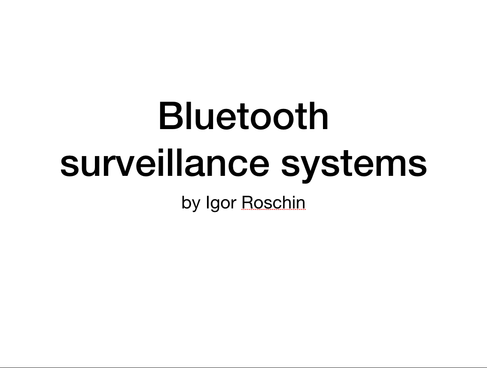
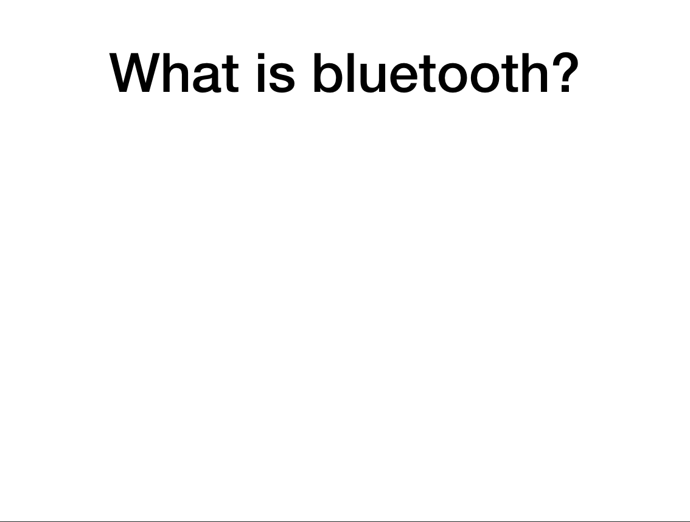
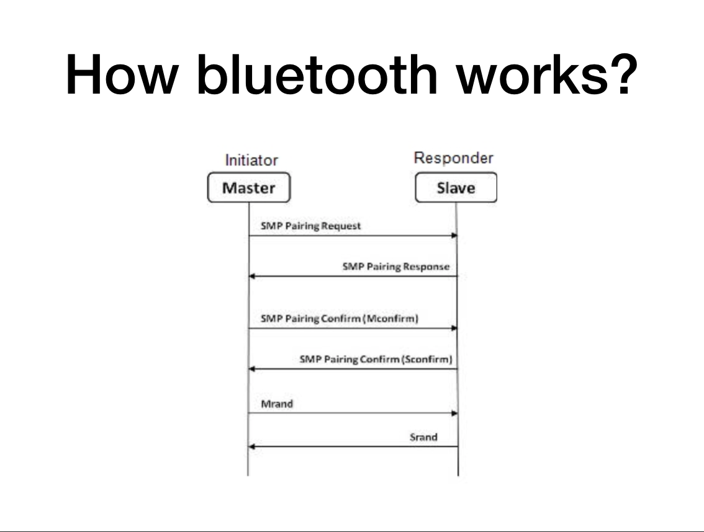
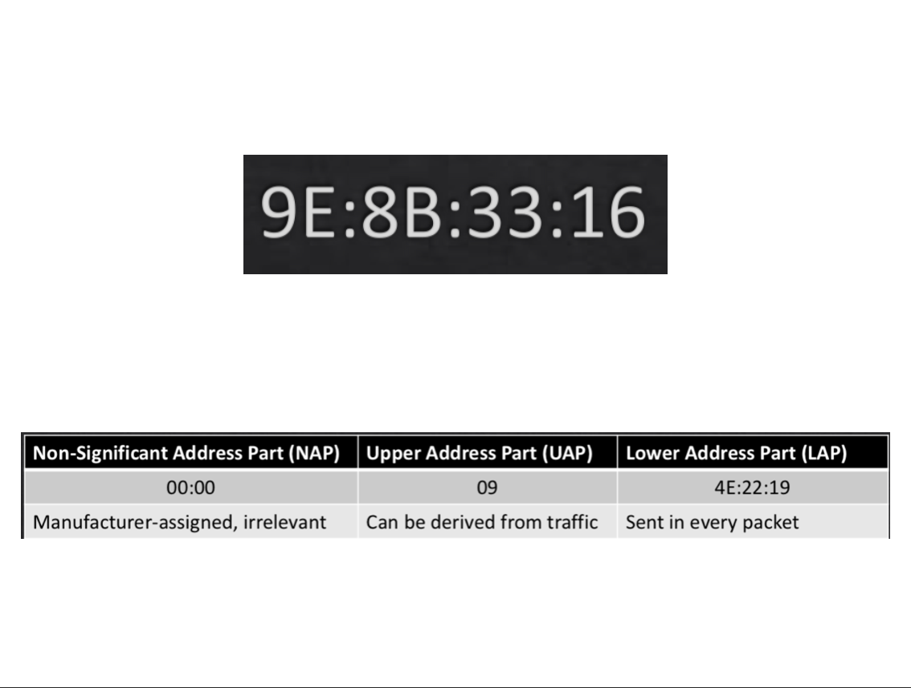
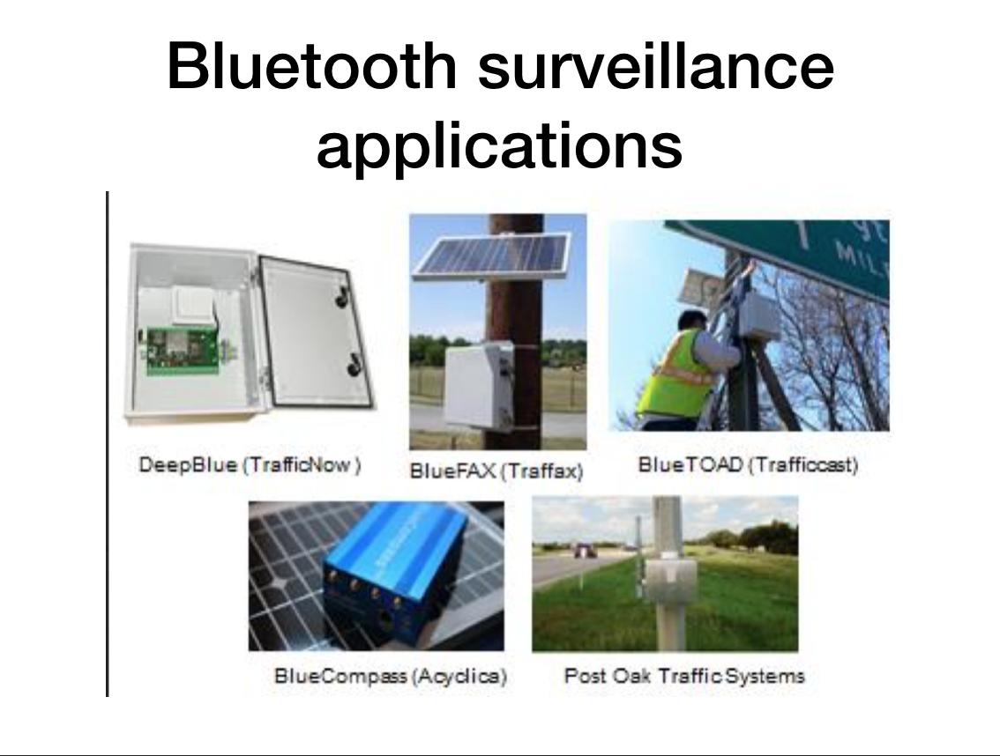
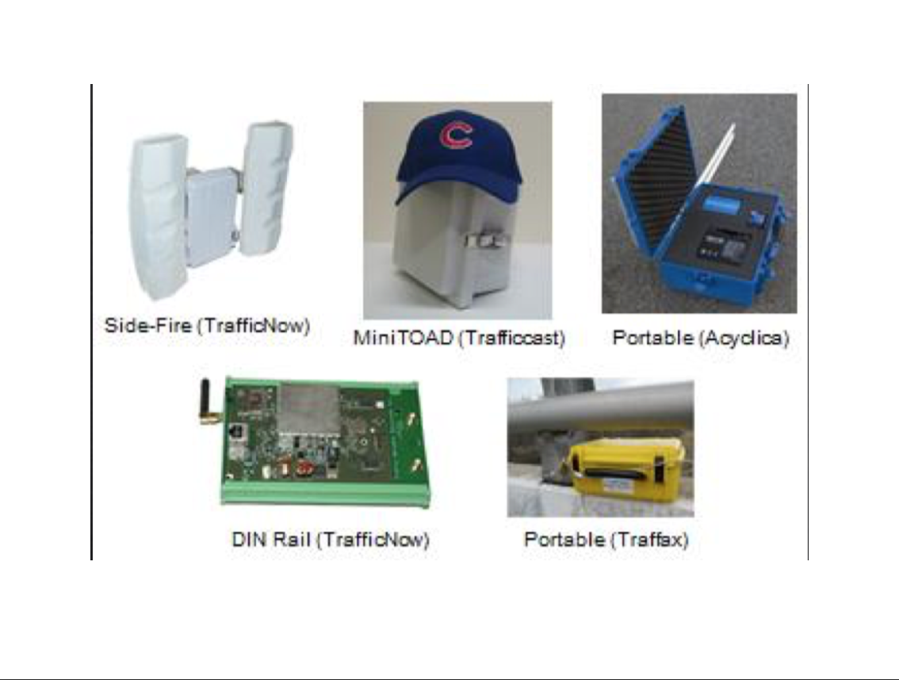
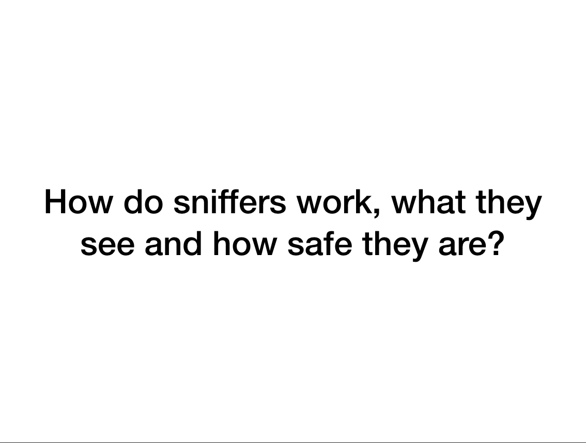
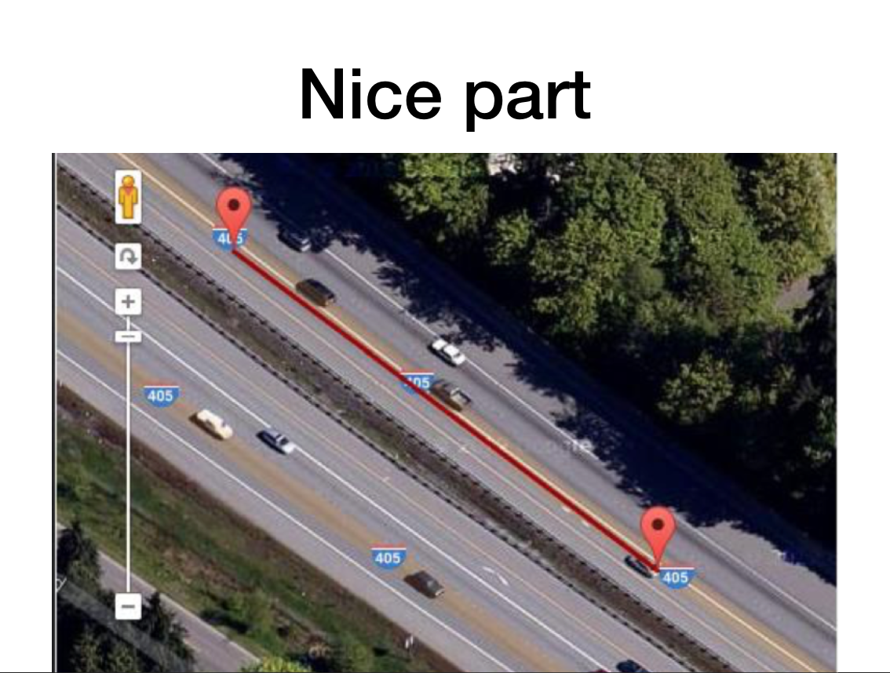
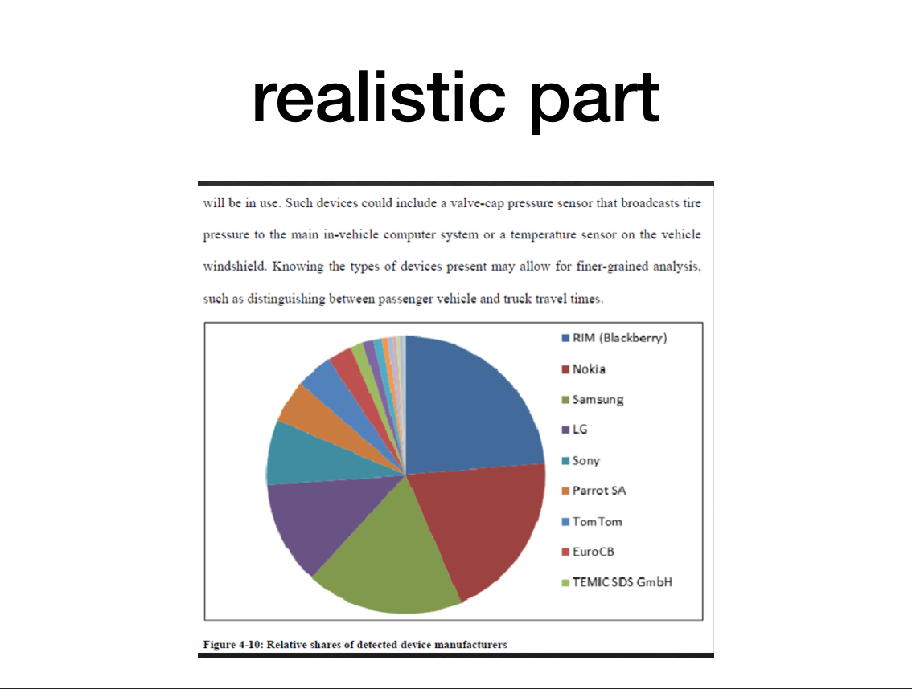
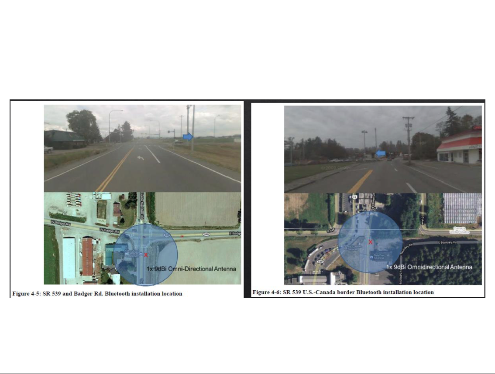

- https://www.defcon.org/images/defcon-22/dc-22-presentations/Bugher/DEFCON-22-Grant-Bugher-Detecting-Bluetooth-Surveillance-Systems-Updated.pdf

Bluetooth survrillance systems

Slide1 Whate id bluetooth?

Bluetooth is a standart wire replacement technology designed for low power consumption.
There are three widely used bluetooth classes. 
Class one is a high power bluetooth for connection over up to hundred meters.
Class two is a mid-powed bluetooth connection over up to tem meters.
And class three is a low power bluetooth for connection over up to one meter.
Class 2 is the most popular among electronic devices that utilises bluetooth tecnology due to it's optimal price and good enought effective range.

Slide2 How bluetooth works?

You can see sequence diagramm for bluetooth handshake. Master-slave notation is used for actor identification. Master is a primery device, slave is a pereferal device, for example, your headphones. Please note "SMP Pairing request" and "SMP Pairing responce"

There are two kind of pairing requests: direct and anonimous. Basicly, direct is used if you already know device, anonimous otherwise.
For anonimous pairing requests general anonimous addres is broadcasted. You can see this address aat the top.

